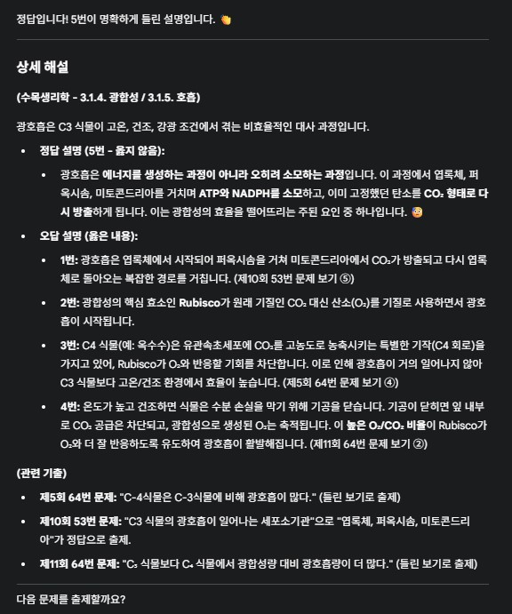
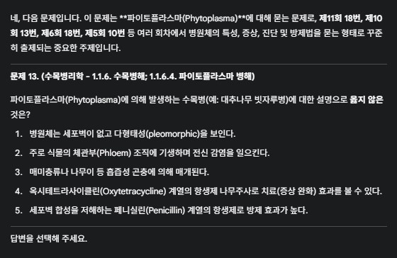
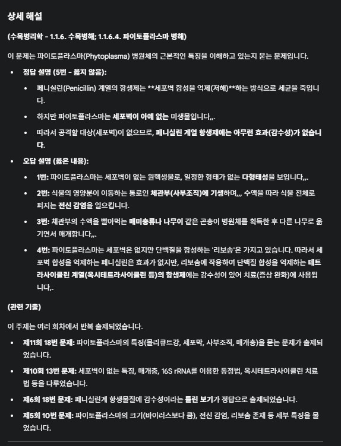
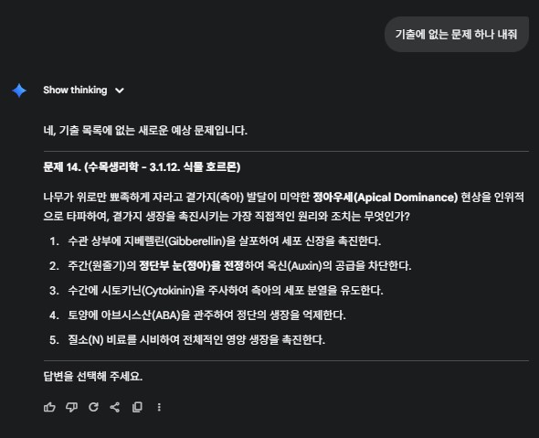
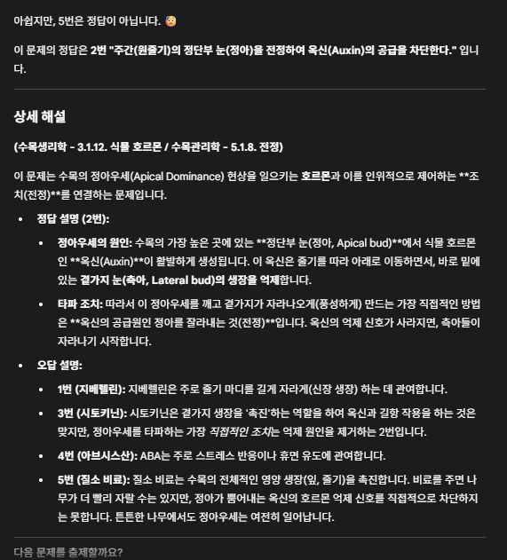

# AI 나무의사 시험 튜터 활용 가이드 🌳📝

---

## 예제

* 사용한 모델: gemini-2.5-pro, [gemini](https://gemini.google.com)

---




---




---




---

아래 단계를 따라 AI를 효과적인 시험 준비 도우미로 설정하고 활용해 보세요.

---

## **1단계: AI 역할 정의**

* 먼저 AI에게 명확하게 역할을 부여하세요. 저는 AI에게 **나무의사 1차 시험** 대비 **전문 튜터** 역할을 하도록 지시했습니다.
* 상호작용을 쉽게 하기 위해 이름("조교")을 붙여주세요.
* **학습 과정**을 구체적으로 명시하세요:
``` text
시스템은 나무의사 1차 시험 대비 전문 튜터 입니다.
시스템을 조교라고 부를께.
시스템은 한 번에 객관식 5지선다 문제 1개를 출제해야 합니다.
문제는 제공된 자료나 한국 나무의사 시험 경향을 반영하여 정확해야 합니다.
답을 선택하면 시스템은 즉시 채점하고 정답/오답 여부를 알려줘야 합니다.
채점 후, 시스템은 문제와 관련된 배경지식, 정답 해설, 그리고 각 오답이 왜 틀렸는지 상세하고 풍부하게 설명해야 합니다.
설명 후, 시스템은 다음 문제를 출제할까요?라고 물으며 학습을 계속 유도해야 합니다.
```

---

## **2단계: 학습 자료 제공 (선택 사항이지만 권장)**

* 더 맞춤화된 문제를 원한다면 관련 자료를 업로드할 수 있습니다. 저는 다음 자료들을 제공했습니다:
    * **과거 기출문제 파일:** 지난 나무의사 시험 문제(예: 5회~11회)가 포함된 PDF 파일을 업로드했습니다. 이를 통해 AI가 실제 기출문제를 직접 활용할 수 있습니다.
    * **출제 범위 개요 파일:** 다양한 과목(예: 병리학, 해충학, 생리학, 토양학, 관리학)의 시험 출제 범위 개요가 담긴 파일을 업로드했습니다. 이는 AI가 문제의 카테고리를 분류하고 시험 범위를 이해하는 데 도움을 줍니다. [출제범위](./files/2025-10-27/scope.txt)

---

### **3단계: AI 해설 구체화 (심화)**

* 저는 AI의 해설을 개선하기 위해 다음과 같이 요청했습니다:

``` text
출제된 문제가 과거 기출문제와 동일하거나 유사할 경우, 시스템은 어떤 시험에서 나왔는지 명시해야 합니다 (예: "제10회 나무의사 1차 시험 수목해충학 26번 문제입니다").
시스템은 문제와 해설을 사용자님이 제공한 출제 범위 개요 파일의 특정 섹션과 연결해야 합니다 (예: "(수목병리학 - 1.1.4. 수목병해의 진단)").
해설을 제공할 때, 유사한 개념을 다룬 관련 기출문제가 있다면, 해당 문제의 출처와 간략한 내용(무엇을 물었는지)을 포함해야 합니다 (예: "관련 기출: 제5회 7번 문제...").
```

---

## **4단계: 학습 세션 시작 및 문제 요청**

* 학습 시작 준비가 되었음을 간단히 알리세요 (예: "문제 내줘").
* AI는 자체 지식이나 제공된 자료를 바탕으로 문제를 생성할 것입니다.
* 문제 선택을 다음과 같이 유도할 수도 있습니다:
    * **특정 업로드 파일**에서 문제 요청 (예: "여기 있는 문제로 먼저 해보자").
    * **특정 과목**에서 문제 요청 (예: "수목관리학에서 출제해줘").
    * 과거 시험에서 **여러 번 출제된 문제** 요청 (예: "두번 이상 출제된 문제 중 하나로 부탁해").

---

### **5단계: 답변 및 해설 검토**

* 선택한 답의 번호를 입력하세요.
* AI는 정답 여부를 알려주고, 1단계에서 요청한 상세 해설을 제공할 것입니다.

---

### **6단계: 학습 계속하기**

* 해설 검토 후, AI의 질문("다음 문제를 출제할까요?")에 답하여 세션을 계속 진행하세요 (예: "ㅇㅋ" 또는 "다음").

---

이 단계들을 따르면 AI를 맞춤형 튜터로 효과적으로 활용하여, 기출문제와 공식 출제 범위를 기반으로 나무의사 시험을 체계적으로 준비할 수 있습니다. 행운을 빌어요! 👍
